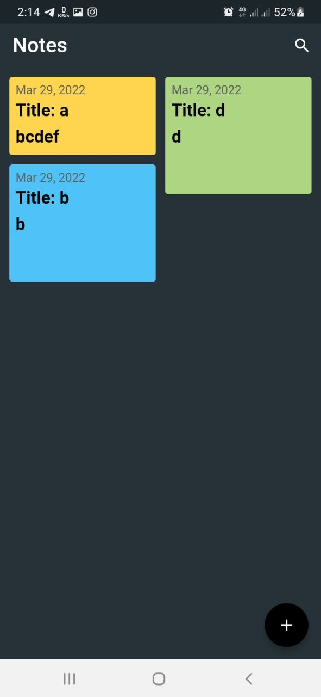
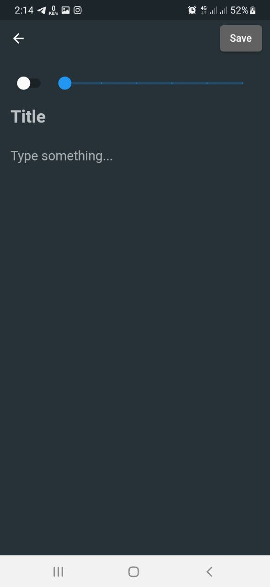
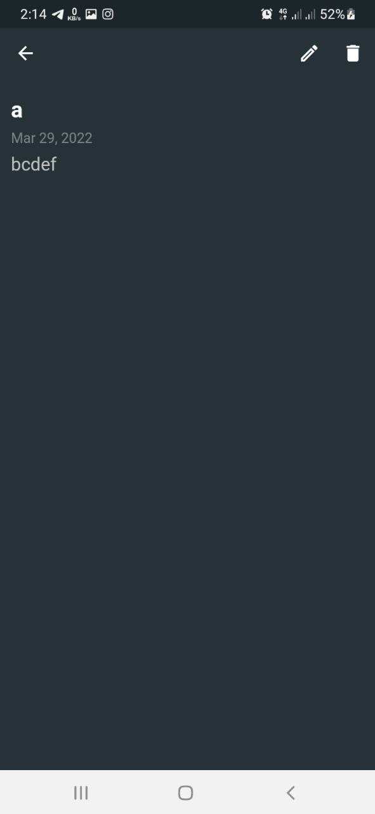

# local_db

In this project,User can create, edit, delete their notes.

# Contents:

* SQfLite
* StaggeredGridView 
* and many more...

# How to Install and Run the Project:

You can run this project:

1. Direct on Android Studio Emulator by this [link](https://github.com/RashadZA/local_db)
2. Physical Device. [Apk_link](https://drive.google.com/file/d/1jUfLB7_3A90HyYE1R7NOuLcz7LLCFf6n/view?usp=sharing)

# How to Use the Project:

* Run this project on emulator or device.
* You will see a Notes list page.
* When you click  add button(FloatingActionButton) add note page will come up.
* Then you type your notes title, details in TextFields.
* After clicking save button you will see your note added in the notes page.
* When you click your notes another page will come up.
* Then you can edit an delete your note.

## Screenshots:

